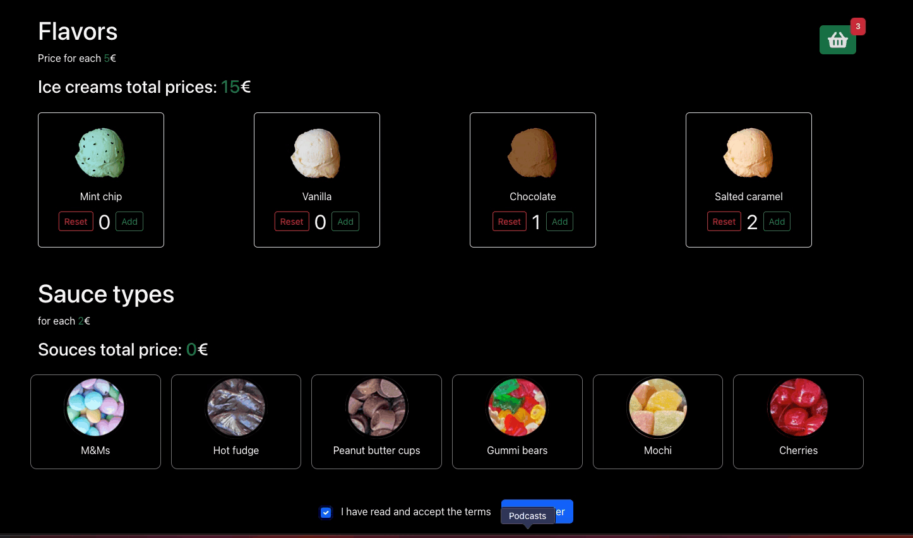

# <h1>IceCream-App</h1>

This application is developed to implement unit test scenarios.The application was developed as responsive.

<h2> Programming Languages Used</h2>

Website is coded with JSX CSS/BOOTSRAP & REACT.JS

# Librarys
- json-server
- bootstrap 
- axios@^0.27.2
- @testing-library/user-event@14.0
- react-icons

<h2>Screen </h2>

